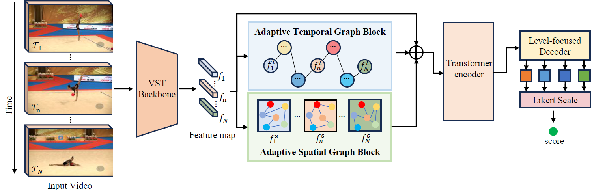

<div align="center">
  <div>
    <h1>
        <a href='https://ieeexplore.ieee.org/abstract/document/10884538'>Adaptive Spatiotemporal Graph Transformer Network for Action Quality Assessment</a>
    </h1>
  </div>

  <br/>
</div>

This is the code for "Adaptive Spatiotemporal Graph Transformer Network for Action Quality Assessment".

## Framework



Key concept of the proposed ASGTN: the method is to capture the intricate local interactions within an individual clip and across clips in a video, as well as the global contextual semantics information of the entire video. To achieve this, we propose an adaptive spatiotemporal graph specifically designed to capture the subtle interactions. In addition, a transformer encoder is integrated to enhance the long-range dependencies, enriching the video feature representation.

## Datasets


- The extracted VST features and label files of Rhythmic Gymnastics and Fis-V datasets can be download from the [GDLT](https://github.com/xuangch/CVPR22_GDLT) repository.

- The original videos of Rhythmic Gymnastics can be downloaded from the [ACTION-NET](https://github.com/qinghuannn/ACTION-NET?tab=readme-ov-file) repository.

- The original videos of Fis-V can be downloaded from the [MS_LSTM](https://github.com/chmxu/MS_LSTM) repository.

## Running
- Training
```
python main.py 
```

- Testing
```
python main.py --ckpt {pkl file here} --test
```
The hyper-parameters can be changed in main.py.
The path of dataset can be changed in options.py. 
## Citation

Please cite this work if you find it useful:

```latex
@ARTICLE{10884538,
  author={Liu, Jiang and Wang, Huasheng and Zhou, Wei and Stawarz, Katarzyna and Corcoran, Padraig and Chen, Ying and Liu, Hantao},
  journal={IEEE Transactions on Circuits and Systems for Video Technology}, 
  title={Adaptive Spatiotemporal Graph Transformer Network for Action Quality Assessment}, 
  year={2025},
  volume={},
  number={},
  pages={1-1},
  keywords={Transformers;Spatiotemporal phenomena;Feature extraction;Quality assessment;Adaptive systems;Semantics;Long short term memory;Decoding;Data mining;Circuits and systems;Action quality assessment;Graph;transformer;deep learning;neural network},
  doi={10.1109/TCSVT.2025.3541456}}
```
## Acknowledgement

Our code is based on [GDLT](https://github.com/xuangch/CVPR22_GDLT). Thanks for their great work!

## Contact

If you have any questions, please feel free to contact me: liuj137@cardiff.ac.uk
